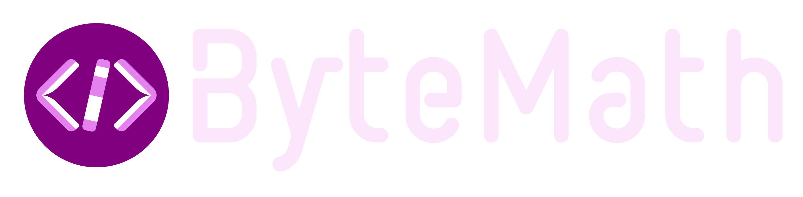

## პროექტის შესახებ

ByteMath არის ინტერაქტიული პლატფორმა, რომელიც შექმნილია მათემატიკის იმ მიმართულებების სწავლებისთვის, რომლებიც კომპიუტერულ მეცნიერებებში გამოიყენება. ჩვენ გთავაზობთ ოთხ მოცულობით კურსს:

- **ორობითი სისტემა**
- **ლოგიკური ოპერატორები**
- **გრაფთა თეორია**
- **რიცხვთა თეორია**

ჩვენი პლატფორმა ფუნქციონირებს ქართულ და ინგლისურ ენებზე, რაც მას ხელმისაწვდომს ხდის ფართო აუდიტორიებისთვის.

## მახასიათებლები

- 📕 საინტერესო მასალა
- 🛠️ ინტერაქტიული სასწავლო რესურსები
- 🧠 თემატობრივი ქვიზები
- 💻 კოდირების სავარჯიშოები
- 📊 პროგრესის დათვალიერება

## 🚀 დასაწყებად

ByteMath პროექტის გაშვებისთვის გამოიყენეთ შემდეგი ბრძანება:

```bash
docker compose up --build
```

---

## About the Project

ByteMath is an interactive platform designed to teach mathematics used in computer science. We offer four comprehensive courses:

- **Binary System**
- **Logical Operands**
- **Graph Theory**
- **Number Theory**

Our platform is available in English and Georgian, making it accessible to a wider audience.

## Features

- 📕 Engaging Content
- 🛠️ Interactive Learning Tools
- 🧠 Challenging Quizzes
- 💻 Coding Exercises
- 📊 Progress Tracking

## 🚀 Getting Started

To launch the ByteMath project, run the following command in your terminal:

```bash
docker compose up --build
```
